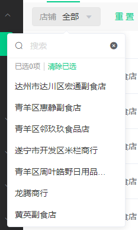
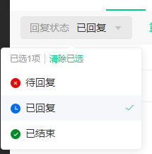

# 一个简单轻量的 省市区 选择器

## 1. 依赖

该选择器是基于 `vue2.0`、`element-ui`、`sass`的一个简单的 下拉选择器，支持多种功能：

1. 单选、多选
2. 远程搜索
3. 分页，下拉加载更多
4. 带icon的筛选


## 2. 使用效果

### 1）远程搜索带分页

> 使用场景：当筛选数据过多时，可通过懒加载的方式，加入搜索框、分页的方式来进行使用



````vue
<template>
  <dh-select
    v-model="searchParam.shop_id"
    title="店铺"
    class="filter"
    more
    filterable
    :loading="filterLoading"
    :option="shop_option"
    @change="handleSearchByPage"
    @search="handleFilterShopSearch"
    @more="handleMoreOption"
  />
</template>

<script>
import DhSelect from '@/components/DhFilter/DhSelect'
import { getShopList } from '@/api/POS/shop/shop'
export default {
  name: 'GoodsList',
  components: { DhSelect },
  data() {
    return {
      filterLoading: false,
      // 筛选信息
      searchObj: {
        search: '',
        page: 1,
        size: 20
      },
      shop_option: [],
      optionTotal: 0,
    }
  },
  created() {
    this.getShopList(this.searchObj)
  },
  methods: {
    /**
     * 网络请求函数
     */
    // 获取店铺列表
    async getShopList(param) {
      try {
        this.filterLoading = true
        const { data: res } = await getShopList(param)
        if (res.code !== 0) {
          return this.$message.warning(res.message)
        }
        this.shop_option.push(... res.data.records.map(v => ({
          value: v.id,
          label: v.shop_name
        })))
        this.optionTotal = res.data.total
      } finally {
        this.filterLoading = false
      }
    },

    /**
     * 筛选事件
     */
    // 店铺选择器
    handleFilterShopSearch(search) {
      this.shop_option = []
      this.searchObj.search = search
      this.searchObj.page = 1
      this.getShopList(this.searchObj)
    },
    // 店铺加载更多
    handleMoreOption() {
      console.log(this.optionTotal, this.shop_option.length)
      if (this.optionTotal > this.shop_option.length) {
        this.searchObj.page += 1
        this.getShopList(this.searchObj)
      }
    },

  }
}
</script>

````


### 2）带状态筛选

> 当只想要进行简单的筛选，并且携带容易观看的icon



````vue
<template>
  <dh-select
    v-model="searchParam.status"
    title="回复状态"
    class="filter"
    icon
    :option="status_option"
    @change="handleSearchByPage"
  />
</template>

<script>
import DhSelect from '@/components/DhFilter/DhSelect'
export default {
  name: 'GoodsList',
  components: { DhSelect },
  data() {
    return {
      status_option: [
        { icon: require('@/assets/filter_icon/status_2.png'), value: 0, label: '待回复' },
        { icon: require('@/assets/filter_icon/status_0.png'), value: 1, label: '已回复' },
        { icon: require('@/assets/filter_icon/status_1.png'), value: 2, label: '已结束' }
      ],
    }
  },
  methods: {
      // 搜索（重置page）
    handleSearchByPage() {
      
    },
  }
}
</script>

````


## 3. 使用方式

1. 将DhSelect文件夹复制到自己项目的 `components` 内
2. 和自定义组件的使用方式一致，具体可参考 `index.vue` 里面的实例


## 4. 参数详解

1. props

| 参数名      | 默认值                         | 解释                                           |
| ----------- | ------------------------------ | ---------------------------------------------- |
| title       | string - 必传                  | 选择框的标题                                   |
| option      | Array - 必传                   | 可供选择项：{ icon: '', label: '', value: '' } |
| value       | String, Number, Array - 默认'' | 显示的值                                       |
| isClear     | Boolean - 默认true             | 是否开启清除已选                               |
| icon        | Boolean - 默认false            | 是否开启图标                                   |
| multiple    | Boolean - 默认false            | 是否开启多选                                   |
| filterable  | Boolean - 默认false            | 是否可筛选                                     |
| loading     | Boolean - 默认false            | 是否查询数据中                                 |
| more        | Boolean - 默认false            | 是否可加载更多                                 |
| optionWidth | String - 默认 '200' 单位px     | 选择区的宽度                                   |
| labelHeight | String - 默认 '32px'           | 选择器的高度                                   |
| labelWidth  | String - 默认 'auto'           | 选择器文本的宽度                               |

2. event

| 方法   | 传出参数           | 解释                 |
| ------ | ------------------ | -------------------- |
| input  | 目前的选中值       | 选中值发生变化时触发 |
| change | 目前的选中值       | 选中值发生变化时触发 |
| search | 搜索框的搜索的参数 | 需要搜索的回调       |
| more   |                    | 下拉加载更多的回调   |

